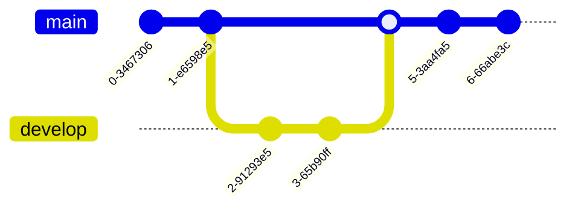

export const meta = {
    header: "Introduction",
    title: "Most developers don't know git",
    description: "Make yourself stand out"
}

## Most developers don't know git well 

And this is a great thing for you. You can differentiate yourself to hiring managers, potential teams considering you, and anyone else you collaborate with 
professionally by demonstrating a strong grasp of git. 

Some day, you'll need to perform a complex git surgery, likely under pressure, in order to fix something or restore a service. You'll be glad then that you 
practiced and learned git well now. 
