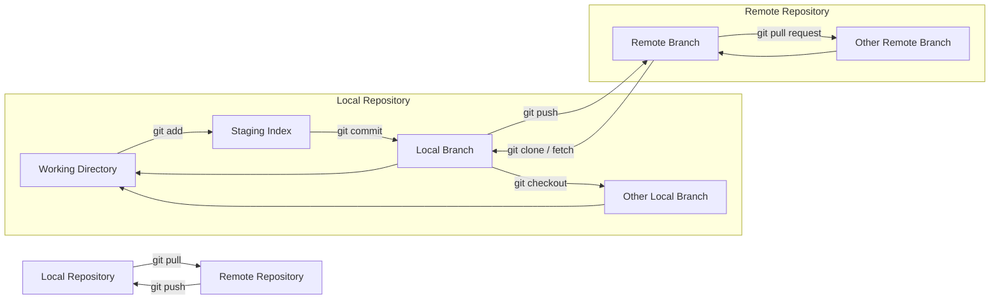

import { ArticleLayout } from '@/components/ArticleLayout'
import { Newsletter } from '@/components/Newsletter'

import Image from 'next/image'
import Link from 'next/link'

export const meta = {
  author: "Zachary Proser",
  date: "7/29/2023",
  title: "Markdown editor test",
  description: "Testing MD editor", 
 }

export default (props) => <ArticleLayout meta={meta} {...props} />
  
 # I always wanted to be a wakka    

And then to do takka 

  
